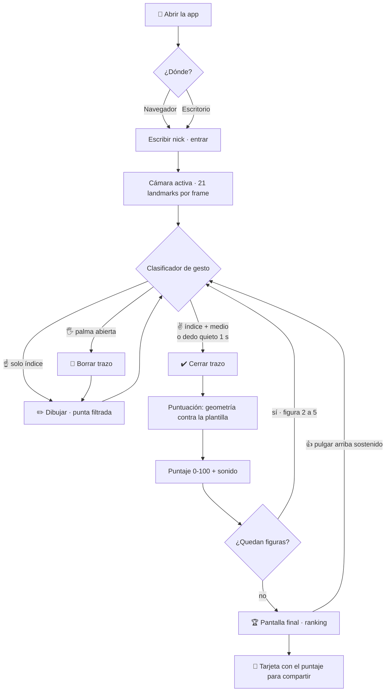
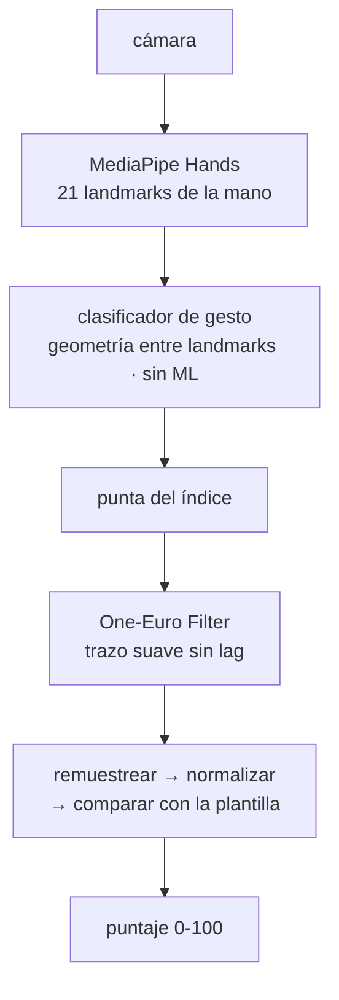
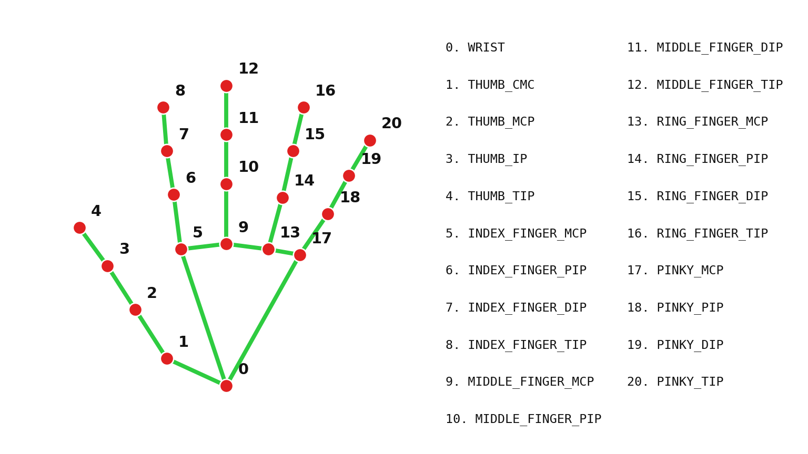
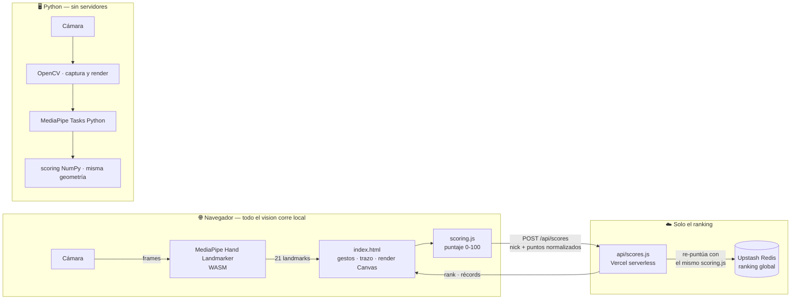

<div align="center">


# 🖐️ Air Draw

[](https://github.com/yeisondev001/air-draw/actions/workflows/ci.yml)
[](https://www.python.org/)
[](https://developer.mozilla.org/es/docs/Web/JavaScript)
[](LICENSE)

**[🎮 Jugar en el navegador](https://air-draw-zeta.vercel.app)**

</div>

---

Un mini juego de **visión por computadora**: te muestra una figura y la dibujas **en el aire con el dedo**. El sistema detecta tu mano con la cámara, sigue la punta del índice y compara tu trazo contra la figura para darte un puntaje de **0 a 100**.

Hay **dos versiones del mismo juego**:

- 🖥️ **Escritorio** — `air_draw.py`, con **Python + OpenCV + MediaPipe**
- 🌐 **Navegador** — `web/`, con **JavaScript + Canvas + MediaPipe WASM** (la jugable en línea, arriba)

Lo interesante: **no hay ningún modelo entrenado para puntuar**. La flor es una curva matemática y la comparación es geometría pura.

Funciona desde el celular (Android e iOS) y desde la computadora. No hay que instalar nada, y **la cámara se procesa en tu dispositivo** — ningún frame se envía a ningún servidor.


---

## 🎯 Cómo se juega

Cinco figuras, siempre las mismas y en el mismo orden (para que los puntajes sean comparables):

⭕ Círculo → 🔺 Triángulo → ⬜ Cuadrado → 🌀 Espiral → 🌸 Flor

La figura objetivo aparece punteada en pantalla como guía. Dibujas encima, cierras el trazo, y te puntúa.

| Gesto | Acción |
|---|---|
| ☝️ **Solo índice** | Dibujar |
| **Dedo quieto 1 s** o ✌️ **índice + medio** | Cerrar el trazo y puntuar (el cierre es automático, con cuenta regresiva) |
| 🖐️ **Palma abierta** | Borrar y reintentar la figura |
| 👍 **Pulgar arriba** | Jugar de nuevo en la pantalla final |

**Teclas:** `R` reinicia la partida · `Q` sale.

---

## 🗺️ Flujo de la aplicación



---

## 🧠 Cómo funciona



El modelo entrega **21 landmarks por mano**: un punto `(x, y, z)` por cada articulación, en tiempo real.



El juego vive de esos números: el cursor es la **punta del índice `8`**, los gestos son geometría entre puntos contra la **muñeca `0`** (invariante a la rotación), y MCP / PIP / DIP / TIP van del nudillo a la punta.

**Tres decisiones del diseño:**

| Decisión | Por qué |
|---|---|
| **One-Euro Filter** | los landmarks tiemblan: filtra fuerte al moverse lento, rápido al acelerar — suavidad sin lag |
| **Histéresis de gestos** | 3 frames seguidos antes de activar un gesto: sin esto la detección parpadea y corta el trazo |
| **Puntaje sin ML** | geometría tipo [$1 Unistroke](https://depts.washington.edu/acelab/proj/dollar/index.html): 64 puntos, normalización, distancia punto a punto + término de curvatura. Un círculo daba 77/100 como "triángulo"; con curvatura, ~51. Determinista, sin dataset |

---

## 🛠️ Tecnologías

Dos versiones del mismo juego, con el mismo motor de puntuación:

### 🖥️ Escritorio — `air_draw.py`


- **MediaPipe Tasks (Vision)** — modelo Hand Landmarker: 21 puntos por mano
- **OpenCV** — captura de video y renderizado
- **NumPy** — remuestreo y comparación vectorizada

### 🌐 Web — `web/` · [▶ jugable en línea](https://air-draw-zeta.vercel.app)


- **JavaScript + Canvas** — sin framework: un solo HTML con el juego
- **MediaPipe Tasks Vision (WASM)** — el mismo modelo corriendo en el navegador
- **Vercel** — hosting + serverless function del ranking
- **Upstash Redis** — ranking global (el servidor recalcula el puntaje: editar el score en devtools no sirve)

**Motor compartido:** `web/scoring.js` es JavaScript puro, lo usa el cliente para mostrar el puntaje y el servidor para recalcularlo antes de guardar — y tiene tests (`node --test tests/`, corren en el CI).


---

## 🏗️ Arquitectura

Dos versiones, el mismo motor de puntuación. La privacidad está en el diseño: la cámara vive en el cliente, **ningún frame de video viaja a ningún servidor** — lo único que viaja es el puntaje, y aun así el servidor lo recalcula para no fiarse del cliente.



---

## 📦 Instalación

### Versión escritorio (Python)

**1. Entorno virtual**

```bash
python -m venv venv
```

Windows:
```bash
.\venv\Scripts\activate
```

macOS / Linux:
```bash
source venv/bin/activate
```

**2. Dependencias**

```bash
pip install -r requirements.txt
```

**3. Ejecutar**

```bash
python air_draw.py
```

El modelo de MediaPipe (~7.5 MB) se descarga solo la primera vez.

### Versión web (JavaScript)

No necesita instalación: [**juega en línea**](https://air-draw-zeta.vercel.app). Para correrla local:

```bash
cd web
python -m http.server 8000    # o cualquier servidor estático
```

y abrí `http://localhost:8000/index.html` (los módulos ES no cargan por `file://`). El ranking global necesita las credenciales de Vercel/Upstash; sin ellas, todo lo demás funciona.

---

## 💡 Notas

- Aléjate de la cámara lo suficiente para que quepa el brazo; los trazos muy pequeños no puntúan.
- Buena luz ayuda bastante a la detección.
- Requiere una cámara web. Se probó en Windows con Python 3.12.

---

## 📄 Licencia

MIT — ver [LICENSE](LICENSE).
