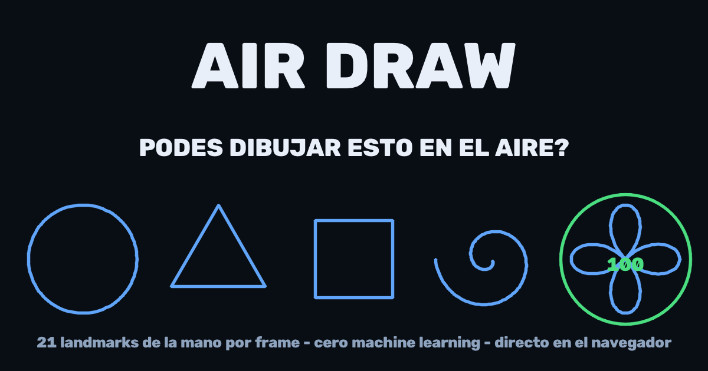
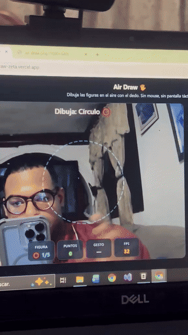

<div align="center">



# 🖐️ Air Draw

[](https://github.com/yeisondev001/air-draw/actions/workflows/ci.yml)
[](https://www.python.org/)
[](LICENSE)

**[🎮 Jugar en el navegador](https://air-draw-zeta.vercel.app)**

</div>

---

Un mini juego de **visión por computadora**: te muestra una figura y la dibujas **en el aire con el dedo**. El sistema detecta tu mano con la cámara, sigue la punta del índice y compara tu trazo contra la figura para darte un puntaje de **0 a 100**.

Lo interesante: **no hay ningún modelo entrenado para puntuar**. La flor es una curva matemática y la comparación es geometría pura.

Funciona desde el celular (Android e iOS) y desde la computadora. No hay que instalar nada, y **la cámara se procesa en tu dispositivo** — ningún frame se envía a ningún servidor.

<!-- TODO: reemplazar por el GIF de la demo -->


---

## 🎯 Cómo se juega

Cinco figuras, siempre las mismas y en el mismo orden (para que los puntajes sean comparables):

⭕ Círculo → 🔺 Triángulo → ⬜ Cuadrado → 🌀 Espiral → 🌸 Flor

La figura objetivo aparece punteada en pantalla como guía. Dibujas encima, cierras el trazo, y te puntúa.

| Gesto | Acción |
|---|---|
| ☝️ **Solo índice** | Dibujar |
| **Dedo quieto 1 s** o ✌️ **índice + medio** | Cerrar el trazo y puntuar (el cierre es automático, con cuenta regresiva) |
| 🖐️ **Palma abierta** | Borrar y reintentar la figura |
| 👍 **Pulgar arriba** | Jugar de nuevo en la pantalla final |

**Teclas:** `R` reinicia la partida · `Q` sale.

---

## 🧠 Cómo funciona

```
cámara → MediaPipe Hands → 21 landmarks de la mano
             ↓
    clasificador de gesto (geometría entre landmarks, sin ML)
             ↓
   punta del índice → One-Euro Filter → trazo suave
             ↓
        remuestrear → normalizar → comparar con la plantilla
             ↓
                  puntaje 0-100
```

**Tres decisiones que vale la pena destacar:**

**1. One-Euro Filter.** Los landmarks tiemblan frame a frame y el trazo sale como un electrocardiograma. Una media móvil lo suaviza pero mete lag. El [One-Euro Filter](https://gery.casiez.net/1euro/) adapta su suavizado a la velocidad del dedo: filtra fuerte cuando te mueves lento, responde rápido cuando aceleras.

**2. Histéresis en los gestos.** Un gesto tiene que mantenerse 3 frames seguidos antes de activarse. Sin esto, la detección parpadea entre "dibujar" y "terminar" y te corta el trazo a la mitad.

**3. Puntaje sin machine learning.** Las figuras son curvas paramétricas — la flor es una *curva rosa*, `r = cos(2·θ)`, que da exactamente 4 pétalos. Para comparar se usa un enfoque tipo [$1 Unistroke Recognizer](https://depts.washington.edu/acelab/proj/dollar/index.html): se remuestrean ambos trazos a 64 puntos equidistantes, se normalizan a centroide y escala común, y se mide la distancia media punto a punto probando todos los puntos de inicio y ambos sentidos de giro.

A eso se le suma un **término de curvatura**: el ángulo de giro en cada punto, medido sobre una ventana de ±4 puntos para que el temblor de la mano no domine la señal. Un círculo da giros chicos y uniformes; un triángulo, tres picos grandes. Sin esto, un círculo puntuaba 77 sobre 100 como "triángulo". Resultado determinista, sin dataset, sin entrenamiento.

---

## 🛠️ Tecnologías

Hay dos versiones del mismo juego, con el mismo motor de puntuación:

**Escritorio (`air_draw.py`)**

- **Python 3.9+**
- **MediaPipe Tasks (Vision)** — modelo Hand Landmarker, 21 puntos por mano
- **OpenCV** — captura de video y renderizado
- **NumPy** — remuestreo y comparación vectorizada

**Web (`web/`, la jugable en línea)**

- **JavaScript + Canvas** — sin framework, un solo HTML con el juego
- **MediaPipe Tasks Vision (WASM)** — el mismo modelo corriendo en el navegador
- **Vercel** — hosting + serverless function del ranking
- **Upstash Redis** — el ranking global (el servidor recalcula el puntaje: editar el score en devtools no sirve)

El motor (`web/scoring.js`) es JavaScript puro y compartido entre cliente y servidor — y tiene tests (`node --test tests/`, corren en el CI).

---

## 📦 Instalación

**1. Entorno virtual**

```bash
python -m venv venv
```

Windows:
```bash
.\venv\Scripts\activate
```

macOS / Linux:
```bash
source venv/bin/activate
```

**2. Dependencias**

```bash
pip install -r requirements.txt
```

**3. Ejecutar**

```bash
python air_draw.py
```

El modelo de MediaPipe (~7.5 MB) se descarga solo la primera vez.

---

## 💡 Notas

- Aléjate de la cámara lo suficiente para que quepa el brazo; los trazos muy pequeños no puntúan.
- Buena luz ayuda bastante a la detección.
- Requiere una cámara web. Se probó en Windows con Python 3.12.

---

## 📄 Licencia

MIT — ver [LICENSE](LICENSE).
