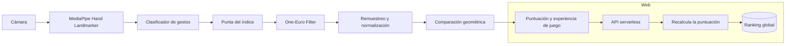

<div align="center">


# Air Draw

**Juego de visión por computadora para dibujar figuras en el aire con la mano.**

[](https://github.com/yeisondev001/air-draw/actions/workflows/ci.yml)
[](https://www.python.org/)
[](https://developer.mozilla.org/es/docs/Web/JavaScript)
[](LICENSE)

[Jugar en el navegador](https://air-draw-zeta.vercel.app) · [Ver arquitectura](#arquitectura) · [Instalación](#ejecución-local)

</div>

---

## Resumen

Air Draw convierte la cámara en una superficie de interacción. El jugador dibuja una figura con la punta de su dedo índice y el sistema compara el trazo con una plantilla geométrica para calcular una puntuación de **0 a 100**.

El proyecto incluye dos implementaciones del mismo concepto:

| Versión | Tecnología | Uso |
| --- | --- | --- |
| Web | JavaScript, Canvas y MediaPipe WASM | Disponible en navegador, escritorio y móvil |
| Escritorio | Python, OpenCV y MediaPipe | Ejecución local con cámara web |

La detección de cámara se procesa en el dispositivo. Ningún frame de video se envía a un servidor.

## Demo

<div align="center">
  
  <br />
  <sub>Detección de mano, trazado en tiempo real y puntuación de círculo, triángulo, cuadrado, espiral y flor.</sub>
</div>

## Experiencia de juego

Air Draw presenta cinco figuras en un orden fijo para que los resultados sean comparables:

**Círculo → Triángulo → Cuadrado → Espiral → Flor**

| Gesto | Acción |
| --- | --- |
| Solo índice | Dibujar |
| Dedo quieto durante 1 segundo o índice + medio | Cerrar el trazo y calcular la puntuación |
| Palma abierta | Borrar y volver a intentar |
| Pulgar arriba | Iniciar una nueva partida al terminar |

Atajos de la versión de escritorio: `R` reinicia la partida y `Q` cierra la aplicación.

## Funcionamiento

La solución no utiliza un modelo entrenado para puntuar. La evaluación combina visión por computadora con geometría determinista:

1. **MediaPipe Hands** identifica los 21 landmarks de la mano.
2. La punta del índice (`landmark 8`) se usa como cursor.
3. Un **One-Euro Filter** suaviza el trazo sin introducir latencia perceptible.
4. El trazo se remuestrea y normaliza a una cantidad fija de puntos.
5. Se compara contra la plantilla con distancia punto a punto y curvatura.
6. El resultado se traduce a una puntuación de 0 a 100.

<div align="center">
  
</div>

## Arquitectura



En la versión web, el ranking es el único componente remoto. El servidor vuelve a calcular el puntaje antes de guardarlo para evitar que el cliente envíe resultados alterados.

## Tecnologías

| Área | Herramientas |
| --- | --- |
| Visión por computadora | MediaPipe Hands / Hand Landmarker |
| Aplicación de escritorio | Python, OpenCV, NumPy |
| Aplicación web | JavaScript ES2022, Canvas 2D, MediaPipe WASM |
| Puntuación | Remuestreo, normalización, distancia geométrica y curvatura |
| Infraestructura web | Vercel Serverless Functions y Upstash Redis |
| Calidad | Node.js Test Runner y GitHub Actions |

## Ejecución local

### Aplicación de escritorio

```bash
git clone https://github.com/yeisondev001/air-draw.git
cd air-draw
python -m venv venv
```

Activa el entorno virtual:

```bash
# Windows
.\venv\Scripts\activate

# macOS / Linux
source venv/bin/activate
```

Instala las dependencias y ejecuta la aplicación:

```bash
pip install -r requirements.txt
python air_draw.py
```

MediaPipe descarga el modelo requerido en la primera ejecución.

### Aplicación web

La versión publicada está disponible en [air-draw-zeta.vercel.app](https://air-draw-zeta.vercel.app).

Para ejecutarla de forma local utiliza un servidor estático:

```bash
cd web
python -m http.server 8000
```

Abre `http://localhost:8000/index.html`. No uses `file://`, porque los módulos ES requieren un servidor local.

## Pruebas

```bash
node --test tests/
```

## Privacidad y requisitos

- Se requiere permiso para acceder a la cámara.
- Una buena iluminación y mantener el brazo completo dentro del encuadre mejora la detección.
- El procesamiento de la cámara ocurre localmente en el dispositivo.
- La versión web solo transmite los datos necesarios para validar y publicar un puntaje en el ranking.

## Licencia

Distribuido bajo la licencia [MIT](LICENSE).
